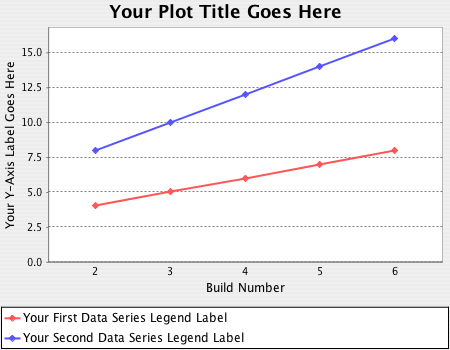

# Plot plugin

[](https://codecov.io/gh/jenkinsci/plot-plugin)
[](https://plugins.jenkins.io/plot)
[](https://github.com/jenkinsci/plot-plugin/releases/latest)
[](https://plugins.jenkins.io/plot/)

## Description

This plugin provides generic plotting (or graphing) capabilities in Jenkins.

This plugin will **plot** one or more **single values variations across builds** in one or more plots. 
Plots for a particular job (or project) are configured in the job configuration screen, 
where each field has additional **help information**. Each plot can have one or more lines (called data series). 
After each build completes the plots' data series latest values are pulled 
from **Java properties file(s), CSV file(s), or XML file(s)** via an XPath (which you should have generated during the build) somewhere below your workspace.
Data for each plot is stored in a CSV file within the job's root project directory.

It can generate various kind of plots, including `Area`, `Bar`, `Line`, `Stacked Bar`, `Waterfall`, etc.

Here is an example of the plots generated by this plugin:



## Configuration

### Currently supported parameters

The currently supported parameters are:

- **`width (int, default: 750)`** The width of the plot in pixels.
- **`height (int, default: 450)`** The height of the plot in pixels.
- **`rightBuildNum (int, default: 2^38 - 1)`** The right-most build number on the plot.
- **`hasLegend (boolean, default: true)`** Whether or not the plot has a legend.
- **`urlNumBuilds (string, default: 2^38 - 1)`** Number of builds back to show on this plot from URL.
- **`urlTitle (string, default: "")`** Title of plot from URL.
- **`urlStyle (string, default: "")`** Style of plot from URL.
- **`urlUseDescr (boolean, default: false)`** Use description flag from URL.
- **`title (string, default: "")`** Title of plot.
- **`yaxis (string, default: "")`** Y-axis label.
- **`series (list)`** List of data series.
- **`group (string)`** Group name that this plot belongs to.
- **`numBuilds (string, default:"")`**
Number of builds back to show on this plot. An empty string means all builds. Must not be "0".
- **`csvFileName (string, default: "$ROOT_DIR/plot-XXXX.csv")`**
The name of the CSV file that persists the plots data. The CSV file is stored in the projects root directory. 
This is different from the source CSV that can be used as a source for the plot.
- **`csvLastModification (long, default: "last modified date")`** The date of the last change to the CSV file.
- **`style (string, default: "line")`** Style of plot: line, line3d, stackedArea, stackedBar, etc.
- **`useDescr (boolean, default: false)`** Whether or not to use build descriptions as X-axis labels.
- **`keepRecords (boolean, default: false)`** Keep records for builds that were deleted.
- **`exclZero (boolean, default: false)`** Whether or not to exclude zero as default Y-axis value.
- **`logarithmic (boolean, default: false)`** Use a logarithmic Y-axis.
- **`yaxisMinimum (string, default: "")`** Minimum y-axis value.
- **`yaxisMaximum (string, default: "")`** Maximum y-axis value.

For a full list of parameters the best place to view is [Plot.java](./src/main/java/hudson/plugins/plot/Plot.java) class.

#### Pipeline job configuration

You can generate the required [Scripted Pipeline](https://jenkins.io/doc/book/pipeline/syntax/#scripted-pipeline)
syntax via the [Snippet Generator](https://jenkins.io/blog/2016/05/31/pipeline-snippetizer/) by choosing the `"plot: Plot build data"` step.

Below you can find sample configuration which is auto-generated using [Snippet Generator](https://jenkins.io/blog/2016/05/31/pipeline-snippetizer/).

```groovy
plot csvFileName: 'plot-8e54e334-ab7b-4c9f-94f7-b9d8965723df.csv', 
        csvSeries: [[
                            file: 'data.csv',
                            exclusionValues: '',
                            displayTableFlag: false,
                            inclusionFlag: 'OFF',
                            url: '']],
        group: 'Plot Group',
        title: 'Plot Title',
        style: 'line',
        exclZero: false,
        keepRecords: false,
        logarithmic: false,
        numBuilds: '',
        useDescr: false,
        yaxis: '',
        yaxisMaximum: '',
        yaxisMinimum: ''
```

- **csvFileName** - autogenerated value, but you might want to change it to something more descriptive for your case.
- **file** - source file for plot generation (relative to workspace)

## JIRA issues

If you have any proposals/bug reports, please create an issue on Jenkins [JIRA](https://issues.jenkins-ci.org/browse/JENKINS-43708?jql=project%20%3D%20JENKINS%20AND%20component%20%3D%20plot-plugin).

## Changelog

See the [Github releases page](https://github.com/jenkinsci/plot-plugin/releases).

### Old release notes 

This is a backup of old release notes from [wiki](https://wiki.jenkins.io/display/JENKINS/Plot+Plugin).

##### Version 2.1.1 (Jun 14, 2019)

- Trim labels and y-values ([PR-52](https://github.com/jenkinsci/plot-plugin/pull/52)).
    - Thanks to [skelliam](https://github.com/skelliam)

##### Version 2.1.0 (Jun 4, 2018)

- Use @DataBoundSetter for optional pipeline parameters ([JENKINS-50636](https://issues.jenkins-ci.org/browse/JENKINS-50636), [PR-48](https://github.com/jenkinsci/plot-plugin/pull/48)).
    - Base Jenkins version was [updated to 2.0](https://github.com/jenkinsci/plot-plugin/pull/48/commits/00da15d7f42b7e7904a1f897448c2d1fae9f9206) version.
    - Thanks to [rmstyrczula](https://github.com/rmstyrczula)

##### Version 2.0.5 (May 15, 2018)

- Update values table CSS style and number formatting ([PR-47](https://github.com/jenkinsci/plot-plugin/pull/47)).
    - Thanks to [Radek Doulik](https://github.com/radekdoulik)

##### Version 2.0.4 (May 5, 2018)

- Fix chart style value comparison, `STACKED_AREA` in particular ([JENKINS-50924](https://issues.jenkins-ci.org/browse/JENKINS-50924)).

##### Version 2.0.3 (January 24, 2018)

- Pass PlotBuilder CTOR params to Plot ([JENKINS-48887](https://issues.jenkins-ci.org/browse/JENKINS-48887)). 
    - "useDescr"/"keepRecords"/"exclZero"/"logarithmic" parameters didn't work properly in pipeline.
    - Thanks to [Reinhold Füreder](https://issues.jenkins-ci.org/secure/ViewProfile.jspa?name=reinholdfuereder)
- Use "regular numeric tick labels" by default for [LogarithmicAxis](http://www.jfree.org/jfreechart/api/javadoc/org/jfree/chart/axis/LogarithmicAxis.html) ([JENKINS-48888](https://issues.jenkins-ci.org/browse/JENKINS-48888))
    - Thanks to [Reinhold Füreder](https://issues.jenkins-ci.org/secure/ViewProfile.jspa?name=reinholdfuereder)  

##### Version 2.0.2 (January 3, 2018)

- Fixed ConcurrentModificationException in PlotBuildAction.java ([JENKINS-48465](https://issues.jenkins-ci.org/browse/JENKINS-48465))
- Fixed typo's in help files ([JENKINS-48530](https://issues.jenkins-ci.org/browse/JENKINS-48530))
- Moved plugin description to wiki ([JENKINS-48537](https://issues.jenkins-ci.org/browse/JENKINS-48537))
- Configured Checkstyle and reformatted the project according to the rules

##### Version 2.0.0 (November 2, 2017)

- Added support for [Pipeline Plugin](https://wiki.jenkins.io/display/JENKINS/Pipeline+Plugin) ([JENKINS-35571](https://issues.jenkins-ci.org/browse/JENKINS-35571)).
    - :red_circle: **Note:** Might break compatibility if you update from 1.X version. Update carefully! :red_circle:

##### Version 1.11 (April 26, 2017)

- Final Release: includes all PRs and fixes up to now

##### Version 1.9 (Mar 15, 2015)

- Added an option to draw plots using a logarithmic Y-axis.
- Fixed `%name%` and `%index%` replacements in the URL for XML files (<http://stackoverflow.com/q/13271710/2654518>).
- Added `%build%`, build number placeholder.

##### Version 1.8 (Sep 28, 2014)

- Added option to exclude zero as default Y-axis value.
- Added option to keep records for deleted builds ([JENKINS-22575](https://issues.jenkins-ci.org/browse/JENKINS-22575)).
- Fixed matrix project support ([JENKINS-24666](https://issues.jenkins-ci.org/browse/JENKINS-24666)).
- Fixed `%name%` and `%index%` replacements in the URL (<http://stackoverflow.com/q/13271710/2654518>).

##### Version 1.7 (Mar 11, 2014)

- Fixed issues parsing XML files, introduced in version 1.6 ([JENKINS-21493](https://issues.jenkins-ci.org/browse/JENKINS-21493)).

##### Version 1.6 (Jan 16, 2014)

- Fixed plot data being retained for deleted builds ([JENKINS-4934](https://issues.jenkins-ci.org/browse/JENKINS-4934)).
- Fixed data out of sync with graph ([JENKINS-15358](https://issues.jenkins-ci.org/browse/JENKINS-15358)).
- Plugin is now available for maven2 ([JENKINS-8478](https://issues.jenkins-ci.org/browse/JENKINS-8478)) and matrix jobs ([JENKINS-15396](https://issues.jenkins-ci.org/browse/JENKINS-15396)).
- Improved XPath support.

##### Version 1.5 (Jul 10, 2011)

- Thread safety fix ([JENKINS-9662](https://issues.jenkins-ci.org/browse/JENKINS-9662)).
- Japanese localization.

##### Version 1.4 (Nov 21, 2010)

- Use `Uri.rawencode` instead of `URLEncoder.encode` for Plot Group ([JENKINS-7245](https://issues.jenkins-ci.org/browse/JENKINS-7245), [JENKINS-8143](https://issues.jenkins-ci.org/browse/JENKINS-8143)).

##### Version 1.3 (Jul 20, 2010)

- Configurable graph style for each plot.
- Read data from XML files ([JENKINS-2796](https://issues.jenkins-ci.org/browse/JENKINS-2796)).
- Read data from CSV files ([JENKINS-2899](https://issues.jenkins-ci.org/browse/JENKINS-2899)).
- Update code for more recent Hudson.
